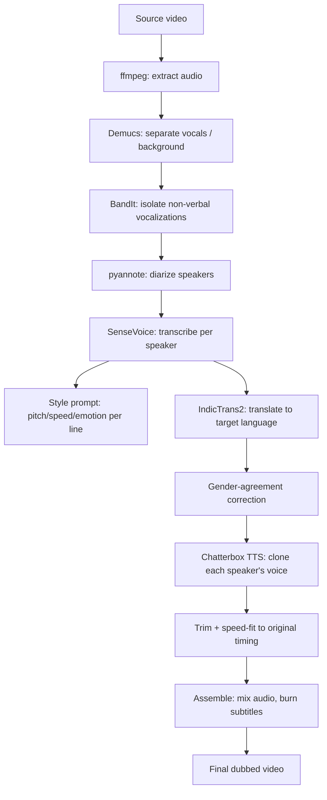

# Dubbing Pipeline

Takes a source video, transcribes it, translates it, and re-synthesizes speech
in one or more target languages **cloning each original speaker's own voice**,
fits each line's timing to match the original speaker's cadence, and can
package multiple languages as selectable audio/subtitle tracks in one file
(like a DVD/Netflix language menu) instead of one file per language.

This started as a solo/unfunded exploration and is still early — expect rough
edges. See [Known issues](./CLAUDE.md#known-open-issues) before relying on it
for anything real. Contributions and issue reports welcome.

## Try it now

[](https://colab.research.google.com/github/CHANDRESH2002/ai-video-dubber/blob/main/AI_Video_Dubber_Demo.ipynb)

Upload your own short video and get it dubbed into Hindi -- cloned speaker
voices, timing-matched, subtitles burned in -- using Google Colab's free GPU.
No local setup needed. Click the badge above.

## How it works




## System requirements

- **OS**: Linux (tested) or Google Colab. Mac can run it too, but two of the
  three environments below can't run natively there (see `CLAUDE.md`).
- **GPU**: strongly recommended -- an NVIDIA GPU with >=15GB VRAM (e.g. a
  T4, which is what Colab's free tier gives you) is enough; CPU-only will
  work but is much slower for diarization/translation/TTS.
- **Disk**: a few GB free for model downloads (Demucs, pyannote,
  SenseVoice, IndicTrans2, Chatterbox all download their own weights on
  first run).
- **`ffmpeg`** installed and on your `PATH` (Colab already has this).
- A free **Hugging Face account + token**, with access accepted on these
  two gated model pages (one-time, ~1 minute):
  - https://huggingface.co/pyannote/speaker-diarization-3.1
  - https://huggingface.co/pyannote/wespeaker-voxceleb-resnet34-LM

## Quick start

This pipeline runs across **three separate Python environments** (not
optional -- see "Why three environments" in `CLAUDE.md`: several of these
models pin conflicting `torch`/`transformers` versions and cannot be
imported into the same process). Set each one up once:

```bash
git clone https://github.com/CHANDRESH2002/ai-video-dubber.git
cd ai-video-dubber

# 1. Main environment -- diarization, transcription dispatch, translation, assembly
python3 -m venv .venv_main
./.venv_main/bin/pip install -r requirements.txt

# 2. Chatterbox environment -- voice-cloned TTS synthesis
python3 -m venv .venv_chatterbox
./.venv_chatterbox/bin/pip install chatterbox-tts "setuptools<81"

# 3. SenseVoice environment -- transcription model itself
python3 -m venv sensevoice-experiment/.venv_sensevoice
./sensevoice-experiment/.venv_sensevoice/bin/pip install funasr torch torchaudio modelscope

Then set your Hugging Face token:
cp .env.example .env   # open .env and paste your HF token in

And run it:
./dub_from_video.sh <video_path> <output_path> <target_lang> [num_speakers]
target_lang defaults to hi (Hindi). num_speakers is optional -- leave
it blank to auto-detect, or set it if you know the exact count (more
reliable on short/noisy clips).

Want to try it without any of this setup? Use the Colab notebook (./AI_Video_Dubber_Demo.ipynb)
instead -- it does all three environment installs for you on Google's free GPU.

See CLAUDE.md (./CLAUDE.md) for the full pipeline architecture, why
three environments are required, known issues, and validated results --
that file is the source of truth for how this project works.

Layout

- components/ — pipeline stages (diarization, transcription, translation,
  synthesis, assembly, evaluation), each independently importable.
  - duration_fit.py — retries a line's translation (via a local LLM
    condensing the English source) when the synthesized audio doesn't fit
    its original time slot, picking whichever attempt lands closest.
  - speed_adjust.py — bounded, pitch-preserving tempo correction (either
    direction) for whatever timing gap remains after duration-fit.
  - multilang_package.py — muxes one video + N language audio/subtitle
    tracks into a single MKV with proper language tags, playable in
    VLC/Plex/Kodi/smart TVs via their normal audio/subtitle menu.
- tests/ — despite the name, dub_multispeaker_*.py and
  run_sensevoice_*.py here are real pipeline-stage entry points, not an
  automated test suite; test_*.py are manual validation scripts requiring
  a real HF_TOKEN and GPU. local_duration_fit_run.py and
  local_multilang_run.py are single-process runners for iterating on
  those two features without the full multi-venv split.
- pipeline.py — older single-speaker/single-file baseline (uses coqui-tts/
  XTTS-v2 instead of Chatterbox), superseded by the components/ pipeline.
  Kept for reference, not the thing to run.
- dub_from_video.sh / dub_multispeaker.sh / dub.sh — orchestration.

Notes

input/, output/, temp/, and all three virtual environments are not
committed here (large, platform-specific) -- follow "Quick start" above to
build them on a fresh machine. Some optional refinement steps (emotion-
aware style prompts, LLM-based gender-agreement correction) use a local
Ollama instance if one's running (ollama pull qwen2.5:14b) and silently
skip themselves otherwise -- not required to get a working dub.
   


